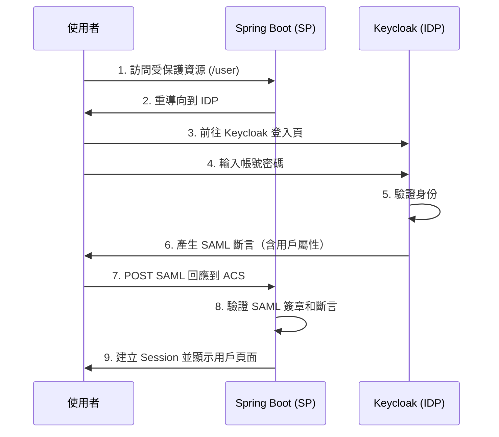

# Spring Security SAML2 認證測試專案

[](https://www.oracle.com/java/)
[](https://spring.io/projects/spring-boot)
[](https://www.docker.com/)

一個完整的 Spring Security SAML2 認證示範專案，展示如何整合 **Keycloak** 作為 Identity Provider (IDP) 實現單一登入 (SSO) 功能。

## 🚀 快速開始

> 💡 **想要立即開始？** 請參閱 [QUICKSTART.md](QUICKSTART.md) 獲取詳細的一鍵啟動指南！

```bash
# 1. 啟動 Keycloak IDP
docker-compose up -d

# 2. 啟動 Spring Boot 應用
mvn spring-boot:run

# 3. 開啟瀏覽器
open http://localhost:8080

# 4. 使用測試帳號登入
# 使用者: testuser
# 密碼: password123
```

## 📋 專案簡介

本專案示範如何使用 Spring Security SAML2 實作企業級的單一登入系統，主要功能包括：

- ✅ SAML2 單一登入 (Single Sign-On)
- ✅ CAS Server 作為 Identity Provider
- ✅ 用戶屬性自動傳遞與顯示
- ✅ 安全登出機制
- ✅ SAML Metadata 自動生成
- ✅ Docker Compose 一鍵部署 IDP

## 🏗️ 技術架構

### 後端技術棧
- **Java 17+**
- **Spring Boot 3.2.0**
- **Spring Security 6.x**
- **Spring Security SAML2 Service Provider**
- **Thymeleaf** - 模板引擎
- **Maven** - 專案管理工具

### Identity Provider
- **Keycloak 23.0** - 開源 IAM 解決方案，運行在 Docker 容器中
- **SAML2 IDP** - 提供完整的 SAML2 認證服務
- **自動配置** - 預配置 Realm、測試用戶和 SAML Client

## 📁 專案結構

```
SpringSecurity-SAML-Test/
├── src/
│   └── main/
│       ├── java/
│       │   └── com/example/saml/
│       │       ├── SamlApplication.java           # 主應用程式
│       │       ├── config/
│       │       │   └── SecurityConfig.java        # Security 配置
│       │       └── controller/
│       │           └── HomeController.java        # 控制器
│       └── resources/
│           ├── application.yml                    # 應用配置
│           └── templates/                         # HTML 模板
│               ├── home.html                      # 首頁
│               ├── user.html                      # 用戶頁面
│               ├── login-error.html               # 登入錯誤頁
│               └── error.html                     # 一般錯誤頁
├── keycloak/                                      # Keycloak 配置
│   └── realm-export.json                          # Realm 自動匯入配置（含用戶和Client）
├── docker-compose.yml                             # Docker Compose 配置
├── pom.xml                                        # Maven 配置
├── progress.md                                    # 開發進度
└── README.md                                      # 本檔案
```

## 🚀 快速開始

### 前置需求

1. **Java Development Kit (JDK) 17+**
   ```bash
   java -version
   ```

2. **Maven 3.6+**
   ```bash
   mvn -version
   ```

3. **Docker & Docker Compose**
   ```bash
   docker --version
   docker-compose --version
   ```

### 安裝步驟

#### 步驟 1: 克隆專案（或直接使用現有專案）

```bash
cd SpringSecurity-SAML-Test
```

#### 步驟 2: 啟動 Keycloak (Identity Provider)

```bash
# 啟動 Docker Compose
docker-compose up -d

# 檢查容器狀態
docker ps

# 查看 Keycloak 日誌
docker logs -f keycloak-idp
```

等待 Keycloak 完全啟動（首次約需 60-90 秒），您可以訪問：
- Keycloak 管理控制台: http://localhost:8443
  - 管理員帳號: `admin`
  - 管理員密碼: `admin`
- SAML IDP Metadata: http://localhost:8443/realms/saml-demo/protocol/saml/descriptor

✅ **自動配置**: Realm、測試用戶和 SAML Client 會自動匯入，無需手動設定！

#### 步驟 3: 編譯 Spring Boot 應用程式

```bash
# 清理並編譯專案
mvn clean package

# 或者使用 Maven Wrapper（如果有的話）
./mvnw clean package
```

#### 步驟 4: 啟動 Spring Boot 應用程式

```bash
# 方式 1: 使用 Maven
mvn spring-boot:run

# 方式 2: 執行 JAR 檔案
java -jar target/spring-security-saml-test-1.0.0-SNAPSHOT.jar
```

應用程式將在 http://localhost:8080 啟動。

## 🧪 測試流程

### 1. 訪問首頁

開啟瀏覽器訪問：http://localhost:8080

您會看到專案首頁，包含系統說明和測試帳號資訊。

### 2. 開始 SAML 登入

點擊「開始使用 SAML 登入」按鈕，系統將：
1. 重導向到 Keycloak 登入頁面
2. 在登入頁面輸入測試帳號（見下方）
3. 認證成功後自動返回應用程式

### 3. 測試帳號

| 使用者名稱 | 密碼 | Email | 角色 | 部門 |
|-----------|------|-------|------|------|
| testuser | password123 | testuser@example.com | user | Engineering |
| admin | admin123 | admin@example.com | admin, user | Administration |

### 4. 查看認證結果

登入成功後，您會看到：
- ✅ 登入成功訊息
- 👤 用戶名稱
- 📋 SAML 屬性資訊
- 🔍 完整的用戶屬性清單

### 5. 測試登出

點擊「登出」按鈕，系統將：
1. 執行本地登出
2. 清除 Session
3. 返回首頁

## 🔍 重要端點

### Spring Boot 應用 (Service Provider)

| 端點 | 說明 | URL |
|------|------|-----|
| 首頁 | 應用程式首頁 | http://localhost:8080/ |
| 用戶頁面 | 需要認證的頁面 | http://localhost:8080/user |
| SP Metadata | Service Provider Metadata | http://localhost:8080/saml2/service-provider-metadata/keycloak |
| SSO 端點 | 接收 SAML 回應 | http://localhost:8080/login/saml2/sso/keycloak |

### Keycloak (Identity Provider)

| 端點 | 說明 | URL |
|------|------|-----|
| 管理控制台 | Keycloak Admin Console | http://localhost:8443 |
| 登入頁面 | Keycloak 登入介面 | http://localhost:8443/realms/saml-demo/protocol/saml |
| IDP Metadata | Identity Provider Metadata | http://localhost:8443/realms/saml-demo/protocol/saml/descriptor |

## 📝 配置說明

### application.yml 重要配置

```yaml
spring:
  security:
    saml2:
      relyingparty:
        registration:
          keycloak:
            # IDP 配置（Keycloak）
            assertingparty:
              entity-id: http://localhost:8443/realms/saml-demo
              metadata-uri: http://localhost:8443/realms/saml-demo/protocol/saml/descriptor
            
            # SP 配置
            entity-id: http://localhost:8080/saml2/service-provider-metadata/keycloak
            acs:
              location: http://localhost:8080/login/saml2/sso/keycloak
```

### Keycloak 配置

Keycloak 的配置透過 Realm 匯入自動完成：
- `keycloak/realm-export.json` - 包含 Realm、用戶、Client 完整配置
- 容器啟動時自動匯入，無需手動設定
- 可透過管理控制台（http://localhost:8443）進行進階配置

## 🔧 故障排除

### 問題 1: Keycloak 無法啟動

**解決方案**:
```bash
# 檢查端口是否被佔用
lsof -i :8443

# 檢查容器日誌
docker logs keycloak-idp

# 重新啟動容器
docker-compose down
docker-compose up -d
```

### 問題 2: SAML 認證失敗

**檢查清單**:
1. ✅ Keycloak 是否正常運行
2. ✅ Realm `saml-demo` 是否已匯入
3. ✅ 測試帳號和密碼是否正確
4. ✅ 網路連線是否正常
5. ✅ 查看應用程式日誌

**查看日誌**:
```bash
# Spring Boot 應用日誌
# 在應用程式執行的終端機查看

# Keycloak 日誌
docker logs -f keycloak-idp
```

### 問題 3: Metadata 無法訪問

**解決方案**:
1. 確認應用程式已完全啟動
2. 檢查防火牆設定
3. 嘗試訪問: http://localhost:8080/saml2/service-provider-metadata/cas

### 問題 4: SSL 憑證錯誤

這是正常現象，因為 CAS Server 使用自簽憑證。

**解決方案**:
- 在瀏覽器中選擇「繼續前往」或「接受風險」
- 生產環境應使用正式的 SSL 憑證

## 🎯 SAML 流程說明



## 📚 相關資源

### 官方文件
- [Spring Security SAML2 文件](https://docs.spring.io/spring-security/reference/servlet/saml2/index.html)
- [Keycloak 文件](https://www.keycloak.org/documentation)
- [Keycloak SAML 指南](https://www.keycloak.org/docs/latest/server_admin/#_saml)
- [SAML 2.0 規範](http://docs.oasis-open.org/security/saml/Post2.0/sstc-saml-tech-overview-2.0.html)

### 學習資源
- [Spring Security 官方指南](https://spring.io/guides/gs/securing-web/)
- [SAML 入門教學](https://developers.onelogin.com/saml)

## 🛠️ 開發指南

### 新增自訂屬性

若要在 SAML 斷言中傳遞更多使用者屬性：

1. **修改 Keycloak Realm 配置** (`keycloak/realm-export.json`):
```json
{
  "protocolMappers": [
    {
      "name": "customAttribute",
      "protocol": "saml",
      "protocolMapper": "saml-user-attribute-mapper",
      "config": {
        "attribute.nameformat": "Basic",
        "user.attribute": "customField",
        "attribute.name": "customAttribute"
      }
    }
  ]
}
```

2. **或透過 Keycloak 管理控制台新增**:
   - 進入 Clients → Spring Boot SAML SP → Client scopes
   - 選擇 dedicated scope → Configure a new mapper
   - 選擇 User Attribute 並設定

3. **在 Controller 中讀取屬性**:
```java
@GetMapping("/user")
public String user(@AuthenticationPrincipal Saml2AuthenticatedPrincipal principal, Model model) {
    String customAttr = principal.getFirstAttribute("customAttribute");
    model.addAttribute("customAttribute", customAttr);
    return "user";
}
```

### 修改登入後的重導向

在 `SecurityConfig.java` 中修改：
```java
.saml2Login(saml2 -> saml2
    .defaultSuccessUrl("/your-custom-page", true)
)
```

## 🤝 貢獻

歡迎提交 Issue 和 Pull Request！

## 📄 授權

本專案僅供學習和測試使用。

## 👨‍💻 作者

- 開發日期: 2025-10-02
- 技術架構: Spring Boot + SAML2 + CAS Server

## ⚠️ 注意事項

1. **本專案僅供開發測試使用**，不建議直接用於生產環境
2. Keycloak 使用 **HTTP** 和 **dev 模式**，生產環境必須啟用 HTTPS
3. 測試帳號密碼為**明文存儲**在 Realm 配置中，生產環境需要整合實際的用戶資料庫
4. 建議在生產環境中啟用**更嚴格的安全設定**（簽章、加密、HTTPS）
5. Keycloak 管理員密碼應使用更安全的密碼並透過環境變數設定

## 📞 支援

如有問題，請查看：
1. **[QUICKSTART.md](QUICKSTART.md)** - 快速啟動指南
2. **[TESTING.md](TESTING.md)** - 詳細測試指南
3. **[KEYCLOAK_ALTERNATIVE.md](KEYCLOAK_ALTERNATIVE.md)** - Keycloak 深入配置
4. **[progress.md](progress.md)** - 開發歷程和決策記錄
5. 應用程式日誌（終端機輸出）
6. Keycloak 日誌（`docker logs -f keycloak-idp`）

---

**享受 SAML2 認證的樂趣！** 🎉
